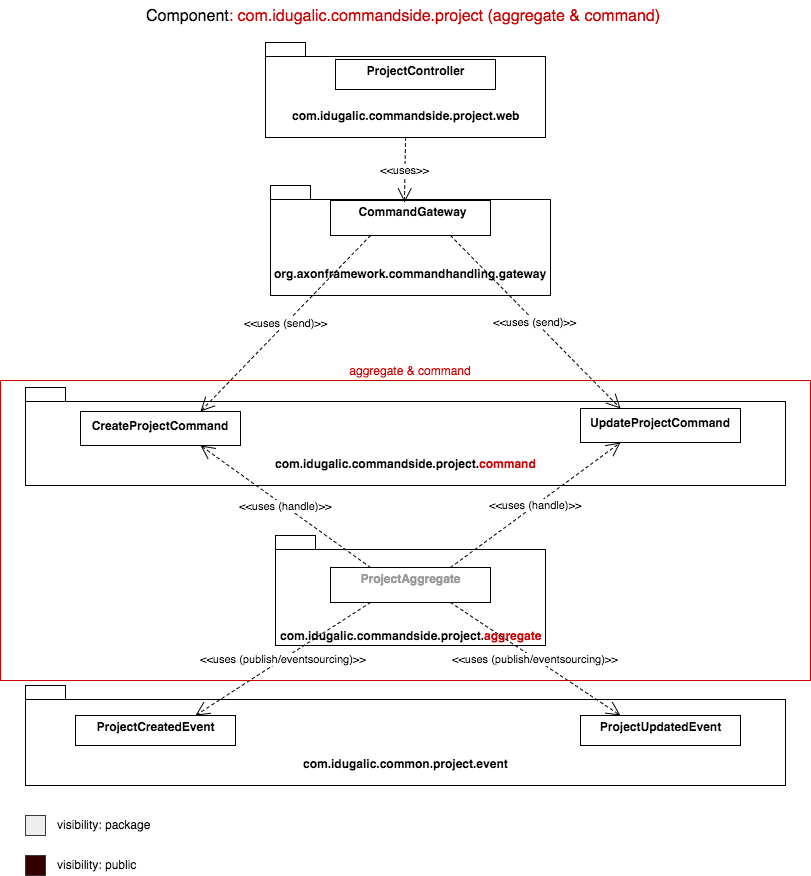
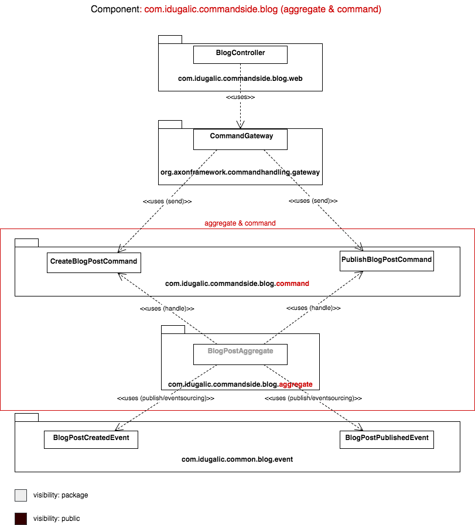
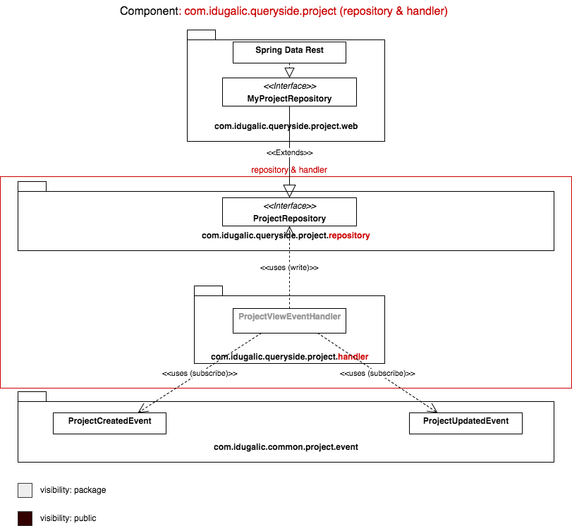

# Architecture Overview

## Patterns and techniques

Patterns/techniques that are used:

* Domain Driven Design
* Command and Query Responsibility Separation \(CQRS\)
* Event Sourcing

## System Context

We are developing an enterprise application. It will support a variety of different clients including desktop browsers, mobile browsers and native mobile applications. This clients will enable employees to manage blog posts, projects information, teams, customers and other data, and it will enable customers to browse the news and submit requests for new interesting projects. The application will also expose an API for 3rd parties \(partners\) to consume and support B2B. It will also integrate with other systems \(Github, LinkedIn, Twitter\) via web services to enrich and to share relevant data with them.

## Containers

* [UI Application - Frontend - Angular](https://github.com/ivans-innovation-lab/my-company-angular-fe)
* [Web Application - Backend - REST API](https://github.com/ivans-innovation-lab/my-company-monolith)
* Database to store events, materialized views and to act as event-bus.

## Components

### UI Application - Frontend - Angular _Components_

We used Angular to implement UI for our solution.

[Atomic design](http://bradfrost.com/blog/post/atomic-web-design/) methodology is used, with the help of [Angular material design components](https://material.angular.io).

Additionally, you can use [StackBlitz](https://stackblitz.com/github/ivans-innovation-lab/my-company-angular-fe) as an online IDE to live edit and preview the project in-browser: [https://stackblitz.com/github/ivans-innovation-lab/my-company-angular-fe](https://stackblitz.com/github/ivans-innovation-lab/my-company-angular-fe)

#### Feature Components vs Presentational Components

Feature and Presentational Component Design pattern has been called many things such as:

* Container Components vs Presentational Components
* Smart/Dumb Components
* Stateful/Stateless Components

**Feature components**

A **Feature component** is a top level component that contains all other components in our feature. This commonly is **a routed component** in Angular. Our feature components are responsible for gathering data from various services for our feature to use. If our user saves data the feature component is responsible to pass that data to our Angular Services to save the data to our server API. Feature components are very slim with the amount of application logic. We try to defer this logic to Services if possible. For this example the [`blog.component`](https://github.com/ivans-innovation-lab/my-company-angular-fe-blog/blob/master/libs/blog/src/blog.component.ts) is our Feature Component and **it is composed of many Presentational components**.

[Feature components](https://github.com/search?q=topic%3Afeature+org%3Aivans-innovation-lab&type=Repositories) are packaged in [libs/modules](https://www.npmjs.com/settings/my-company-frontend/packages).

**Presentational components**

**Presentational Components behave like pure functions** taking in the data via @Input and emitting data via @Output. This allows the majority of our UI to not know the underlying implementation detail of where the data came from. For example a [`side-item.component`](https://github.com/ivans-innovation-lab/my-company-angular-fe-presentational-components/blob/master/libs/presentational-components/src/side-menu-item/side-menu-item.component.ts) takes in a @Input of an item to display. This allows the `side-item.component` component to have the only responsibility of rendering the item when the data is passed to it.

Many if not **most Presentational Components can be abstracted into a style guide or UI library** for the project. Using a shared style guide for an organization or project improves reusability, increases the consistency between the different views that form a web application and encourages the communication between the different teams. It can also ensure that a unified brand is used across different products. To get ideas of component design and style guide maintainability I recommend Brad Frost’s book [Atomic Design](http://bradfrost.com/blog/post/atomic-web-design/).

There are downsides to this though. As the feature grows in complexity we may have a deeply nested component structure. Since presentation component events only bubble up one level at a time we will have to manually pass up to each parent component. **Introducing other sub feature components** \([`blog-list.component`](https://github.com/ivans-innovation-lab/my-company-angular-fe-blog/blob/master/libs/blog/src/blog-list/blog-list.component.ts), [`blog-detail.component`](https://github.com/ivans-innovation-lab/my-company-angular-fe-blog/blob/master/libs/blog/src/blog-detail/blog-detail.component.ts), [`blog-new.component`](https://github.com/ivans-innovation-lab/my-company-angular-fe-blog/blob/master/libs/blog/src/blog-new/blog-new.component.ts)\) can help elevate this. The communication between feature components is event driven, and enables loose coupling. For example a `blog-new.component` will trigger an event on successfull creation of a blog post, and `blog-list.component` is subscribed to it so it can re-fetch and refresh a list of blog posts.

[Presentational components](https://github.com/ivans-innovation-lab/my-company-angular-fe-presentational-components) are packaged in a \[lib/module\].\([https://www.npmjs.com/package/@my-company-frontend/presentational-components](https://www.npmjs.com/package/@my-company-frontend/presentational-components)\)

### Web Application - Backend - REST API _Components_

The domain is literally split into a command-side component and a query-side component \(this is [CQRS](http://microservices.io/patterns/data/cqrs.html) in its most literal form\). Communication between the two components is event-driven and the demo uses simple event store \(Database in this case - JPA - HSQLDB\) as a means of passing the events between components.

The command-side processes commands. Commands are actions which change state in some way. The execution of these commands results in Events being generated which are persisted by Axon \(using SQL DB - HSQLDB\) and propagated out to components. In [event-sourcing](http://microservices.io/patterns/data/event-sourcing.html), events are the sole records in the system. They are used by the system to describe and re-build aggregates on demand, one event at a time.

The query-side is an event-listener and processor. It listens for the Events and processes them in whatever way makes the most sense. In this application, the query-side just builds and maintains a materialized view which tracks the state of the individual aggregates \(Product, Blog, ...\).

Every component is a separate [maven](https://maven.apache.org/what-is-maven.html) project/library:

#### Project Command side component

* [https://github.com/ivans-innovation-lab/my-company-project-domain](https://github.com/ivans-innovation-lab/my-company-project-domain)

#### Blog Posts Command side component

* [https://github.com/ivans-innovation-lab/my-company-blog-domain](https://github.com/ivans-innovation-lab/my-company-blog-domain)

#### Project Query side component

* [https://github.com/ivans-innovation-lab/my-company-project-materialized-view](https://github.com/ivans-innovation-lab/my-company-project-materialized-view)

#### Blog Posts Query side component

* [https://github.com/ivans-innovation-lab/my-company-blog-materialized-view](https://github.com/ivans-innovation-lab/my-company-blog-materialized-view)

The command-side and the query-side do not have REST API's. This is why we need another component - web component, which will expose capabilities of all other components via REST API, and package application in one _'.war'_ archive by including other components as depended libraries.

#### Web component

* [https://github.com/ivans-innovation-lab/my-company-monolith](https://github.com/ivans-innovation-lab/my-company-monolith) 

## Technologies

* [Spring Boot](http://projects.spring.io/spring-boot/) \(2.0.0.RELEASE\)
* [Spring Data](http://projects.spring.io/spring-data/)
* [Spring Data REST](http://projects.spring.io/spring-data-rest/)
* [Axon Framework](http://www.axonframework.org/) \(3.1.3\)
* My SQL / HSQLDB

