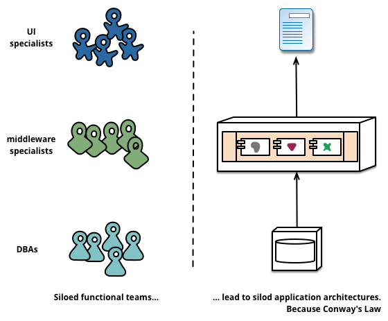

# Chapter 2 - Organization

Many years ago, Melvin Conway had observed that how organizations were structured would have a strong impact on any systems they created. In his “[How Do Committees Invent](http://www.melconway.com/research/committees.html)" he wrote:

> "Any organization that designs a system \(defined more broadly here than just information systems\) will inevitably produce a design whose structure is a copy of the organization's communication structure."

At the time, the Harvard Business Review rejected his original paper based on the fact that he hadn’t proved his hypothesis. Nonetheless, this observation has become known as Conway’s Law, and the collective experiences of both my colleagues and myself have time and again reinforced the truth of this statement.

When looking to split a large application into parts, often management focuses on the technology layer, leading to UI teams, server-side logic teams, and database teams. When teams are separated along these lines, even simple changes can lead to a cross-team project taking time and budgetary approval.

The microservice approach to division is different, splitting up into services organized around **business capability**. Such services take a broad-stack implementation of software for that business area, including user-interface, persistant storage, and any external collaborations. Consequently the teams are cross-functional, including the full range of skills required for the development.

The core team is composed of developers, operations, designers, and a product owner. There are also some supporting roles that come and go as needed—testers, architects, DBAs, data scientists, and other specialists.

## Developer/Engineer

These are programmers or software developers. Through the practice of pairing, knowledge is quickly spread among developers, ensuring that there are no empires built and addressing the risks of a low bus factor. Developers are encouraged to rotate through various roles from front to back-end to get good exposure to all parts of a project. By using a cloud platform, like Cloud Foundry, developers can also package and deploy code on their own through continuous integration and continuous delivery \(CI/CD\) tools.

## Operations

Until business capabilities teams in a cloud-native environment have learned the necessary skills to operate applications on their own, they will need operations support. This support will come in the form of understanding \(and co-learning!\) how the cloud platform works, as well as gaining assistance troubleshooting applications in production.

## Product Owner/Product Manager

This role defines and guides application requirements. It is also one of the roles that most varies in responsibilities across products. At its core, this role is the owner of the software under development. In that respect, product roles help prioritize, plan, and deliver software that meets requirements, or stories, as theyʼre commonly called.

## Designer

One of the major lessons of contemporary software is that design matters a tremendous amount more than previously believed. While nice-looking UIs are, well, nice to have, design in software is so much more than looks. The designer takes responsibility to deeply understand the needs and challenges that users have, and how to create solutions to overcome these challenges. You might think of designers as the empathizers in chief.

Large monolithic applications can always be modularized around business capabilities too, although that's not the common case. Certainly we would urge a large team building a monolithic application to divide itself along business lines. The main issue we have seen here, is that they tend to be organized around too many contexts. If the monolith spans many of these modular boundaries it can be difficult for individual members of a team to fit them into their short-term memory. Additionally we see that the modular lines require a great deal of discipline to enforce. The necessarily more explicit separation required by service components makes it easier to keep the team boundaries clear.

