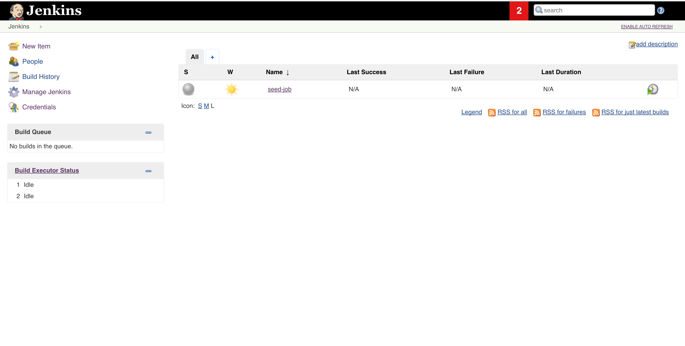
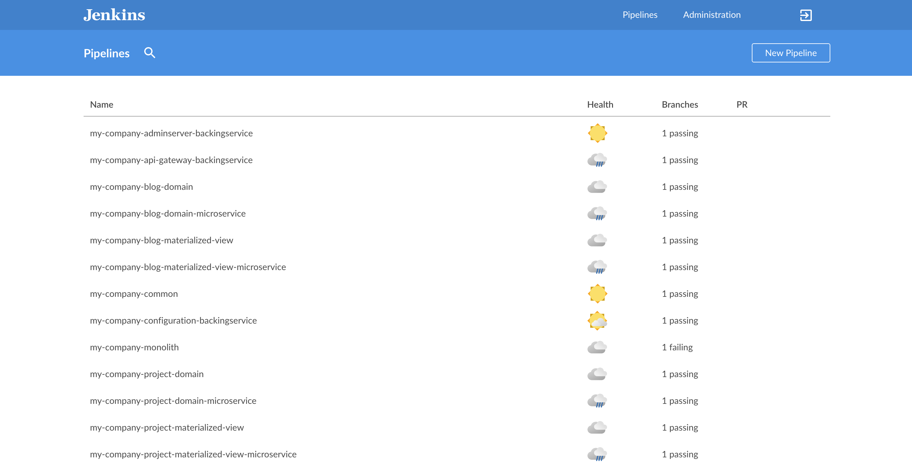
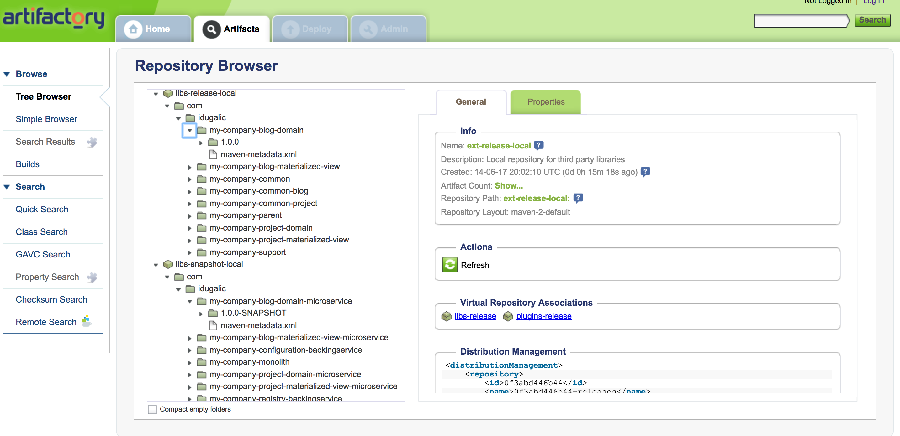
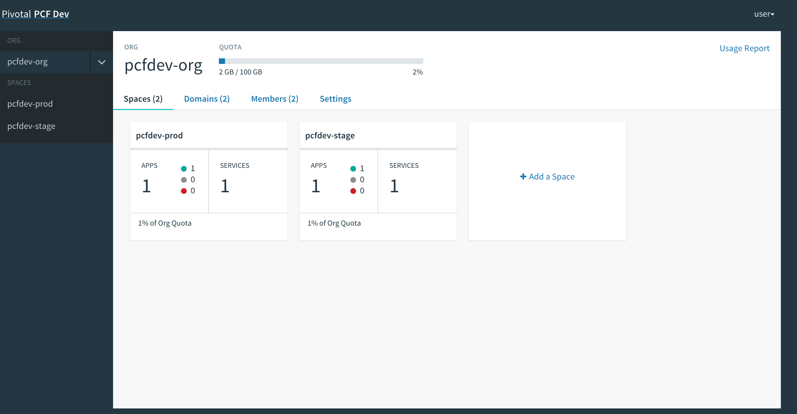

# Private Cloud

Jenkins, Artifactory and Pivotal Cloud Foundry are on our system. We will use Docker to run Jenkins and Artifactory.

* **Jenkins** is the open source continuous integration server
* **Artifactory** is the open source maven repository
* **Docker** is an open platform for developers and sysadmins to build, ship, and run distributed applications, whether on laptops, data center VMs, or the cloud.
* **PCF Dev** is a small footprint distribution of Pivotal Cloud Foundry \(PCF\) intended to be run locally on a developer machine. It delivers the essential elements of the Pivotal Cloud Foundry experience quickly through a condensed set of components. We will use [PCF Dev](https://pivotal.io/pcf-dev) to deploy applications on staging and production environments.

## Deployment Pipelines

* all jobs are under version control and described via [Job-DSL](https://github.com/jenkinsci/job-dsl-plugin/wiki), see the [my-company-ci-jobs](https://github.com/ivans-innovation-lab/my-company-ci-jobs) repo
* there is a [seed-job](https://github.com/ivans-innovation-lab/my-company-infrastructure/blob/master/seedJob.xml) which runs periodically to ensure the aforementioned multi-branch jobs exist in Jenkins
* each project to be built by these jobs defines its own pipeline via [Pipeline-DSL](https://jenkins.io/doc/book/pipeline/syntax/) in a`Jenkinsfile,(`Pipeline as Code`)` see the:
  * [my-company-common](https://github.com/ivans-innovation-lab/my-company-common)
  * [my-company-blog-domain](https://github.com/ivans-innovation-lab/my-company-blog-domain)
  * [my-company-project-domain](https://github.com/ivans-innovation-lab/my-company-project-domain)
  * [my-company-blog-materialized-view](https://github.com/ivans-innovation-lab/my-company-blog-materialized-view)
  * [my-company-project-materialized-view](https://github.com/ivans-innovation-lab/my-company-project-materialized-view)
* artifacts are deployed on Artifactory instance. Parent maven [pom](https://github.com/ivans-innovation-lab/my-company-common/blob/master/pom.xml) file is configured to use the Artifactory.

## Running Jenkins and Artifactory

```text
$ ./start.sh gituser gitpassword
```

Once **Jenkins** is started you should see at least the seed-job on [http://localhost:9090](http://localhost:9090/).

If it has not run yet, simply trigger it and see how the actual jobs/pipelines get created \(Jenkins Blue Ocean\).

**Artifactory** is available on [http://localhost:9091](http://localhost:9091/)

## Running Pivotal Cloud Foundry

You have to download and start PCF Dev. [A link how to do it is available here.](https://pivotal.io/platform/pcf-tutorials/getting-started-with-pivotal-cloud-foundry-dev/install-pcf-dev)

The default credentials when using PCF Dev are:

```text
username: user
password: pass
email: user
org: pcfdev-org
space: pcfdev-space
api: api.local.pcfdev.io
```

You can start the PCF dev like this:

```text
cf dev start
```

You’ll have to create minimum 2 separate spaces \(email admin, pass admin\)

```text
cf login -a https://api.local.pcfdev.io --skip-ssl-validation -u admin -p admin -o pcfdev-org

cf create-space pcfdev-stage
cf set-space-role user pcfdev-org pcfdev-stage SpaceDeveloper
cf create-space pcfdev-prod
cf set-space-role user pcfdev-org pcfdev-prod SpaceDeveloper
```

Apps Manager URL: [https://local.pcfdev.io](https://local.pcfdev.io)

## Adopt it

Please note that this scenario can be adopted to your needs:

* You can use some other virtualization tool, or choose not to use virtualization.
* You want to save Jenkins configuration \(docker volumes\)
* You want to create Jenkins slaves
* You like more Nexus then Artifactory
* You don't want to create and manage multi-branch jobs by yourself \([my-company-ci-jobs](https://github.com/ivans-innovation-lab/my-company-ci-jobs)\). You want to use [Github Organization Folder Plugin](https://github.com/jenkinsci/github-organization-folder-plugin)
* You want to use Groove \(script\) style of Jenkinsfile rather then declarative style.
* You don't want to use PCF as platform as a service \(PaaS\). You want to use a container as a service \(CaaS\) layer.
* You want to install Gitlab and use GitlabCI on premise.

