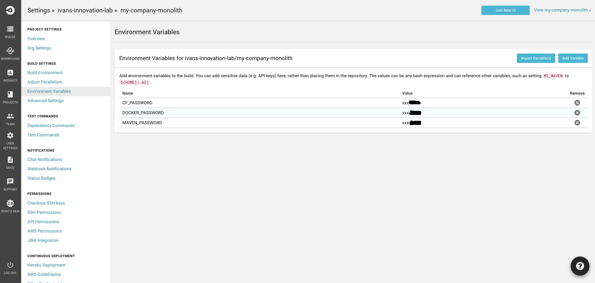
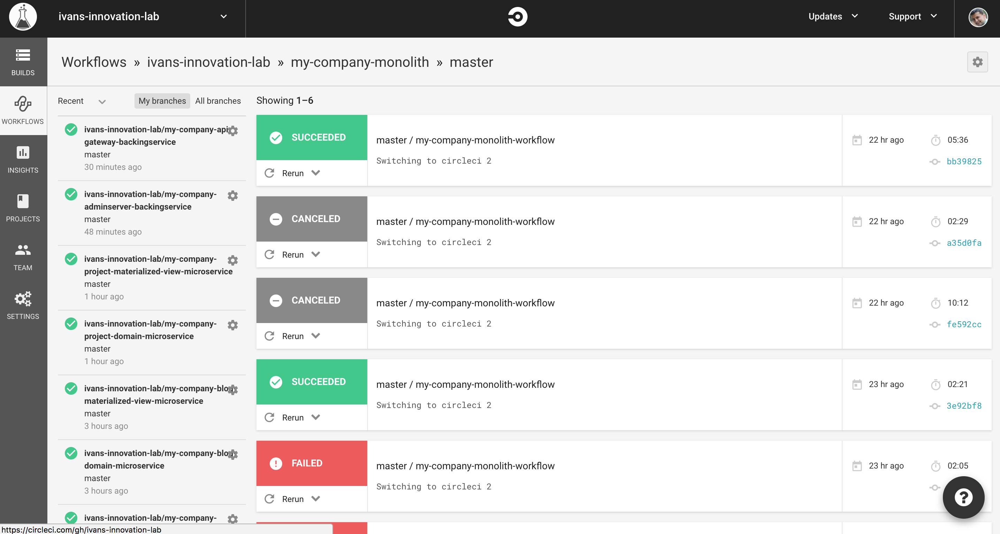
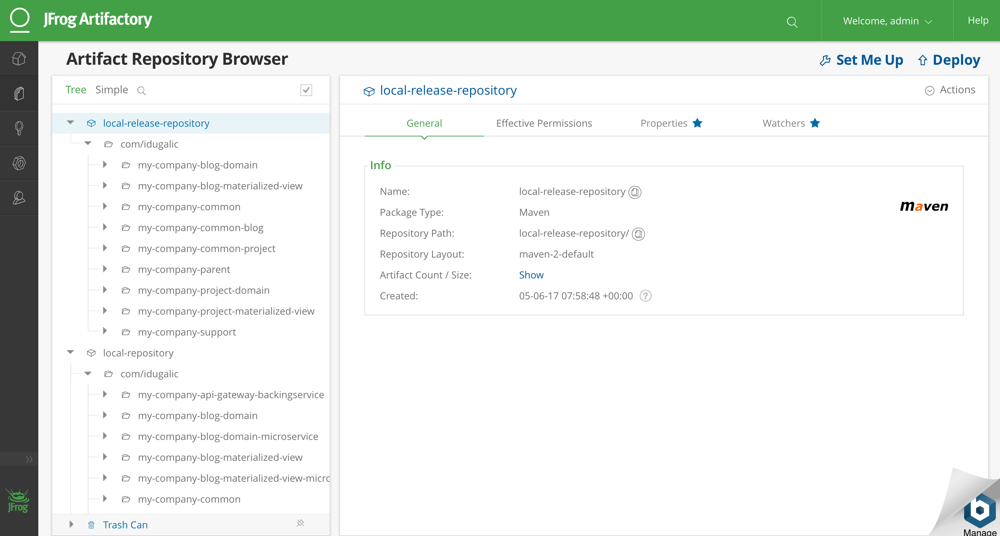
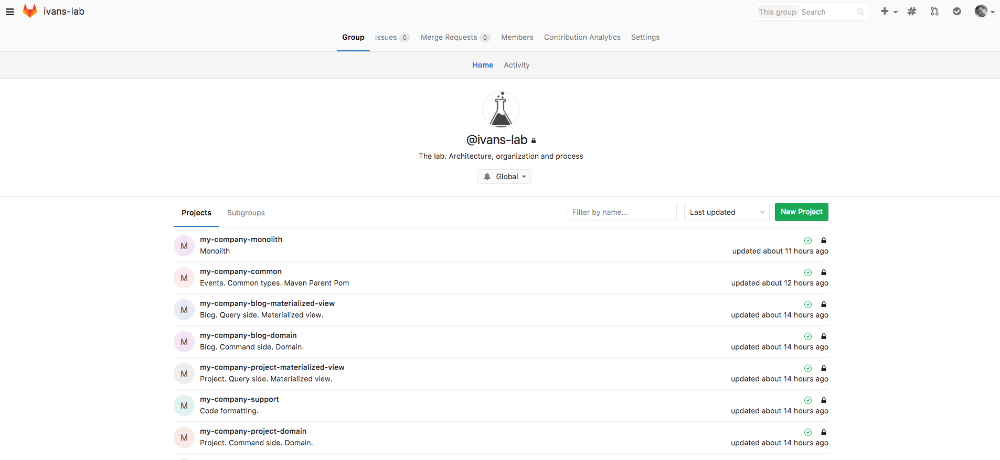
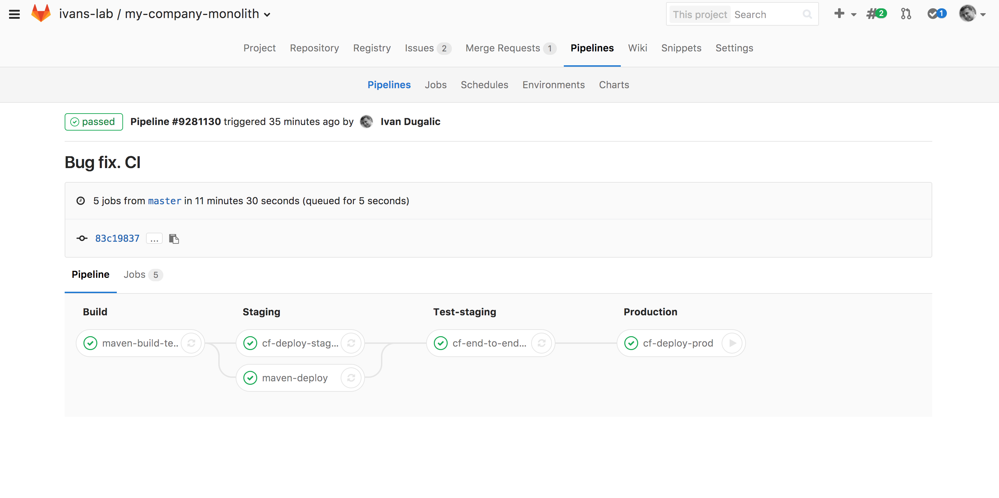
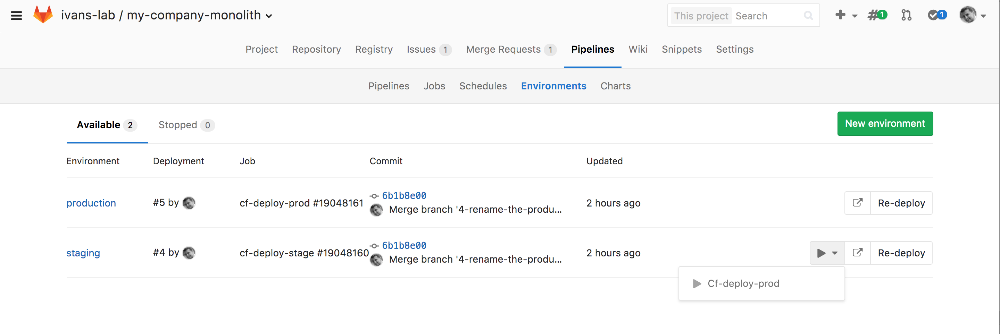

# Public Cloud

Artifactory, CircleCI 2 and PWS are on the public cloud, and you don't need to install them.

* [Artifactory](https://www.jfrog.com/artifactory/) as Maven repository on AWS
  * [http://maven.idugalic.pro](http://maven.idugalic.pro)
* [CircleCI](https://circleci.com/) as continuous integration and delivery ****platform
* [PWS](http://run.pivotal.io/) - an instance of the Cloud Foundry platform-as-a-_service_  operated by Pivotal Software, Inc.

## Deployment Pipelines

Each maven project/repository defines its own pipeline/workflow in a .[circleci/config.yml](https://github.com/ivans-innovation-lab/my-company-monolith/blob/master/.circleci/config.yml) file. Pipeline is using maven tool, and maven settings file \([.circleci/maven.settings.xml](https://github.com/ivans-innovation-lab/my-company-monolith/blob/master/.circleci/maven.settings.xml)\) is included. Make sure that your environment variables \(MAVEN\_PASSWORD, CF\_PASSWORD\) are configured in every 'build' project on CircleCI.

Any project that has .[circleci/config.yml](https://github.com/ivans-innovation-lab/my-company-monolith/blob/master/.circleci/config.yml) configured will be build automatically by CircleCI:



Artifacts are deployed on [Artifactory instance](http://maven.idugalic.pro/artifactory/webapp/#/home) in the cloud \(AWS hosted\). Parent maven [pom](https://github.com/ivans-innovation-lab/my-company-common/blob/master/pom.xml) file is configured to use this instance with maven profile 'idugalic-cloud'. Make sure that your parent maven pom file is configured by your needs. 

## Adopt it

### For open projects

[CircleCI](https://circleci.com/) offer a total of four free linux containers \($2400 annual value\) for open-source projects. Simply keeping your project public will enable this for you! You can consider [Travis CI](https://travis-ci.org/), it is free for open source as well.

### For private projects

You can use:

* CircleCI and Travis for private projects
* [Bitbucket](https://bitbucket.org/product) and [Bitbucket Pipelines](https://bitbucket.org/product/features/pipelines). Atlassian products are mature and very good integrated. 
* [Gitlab](https://about.gitlab.com/) unifies issues, code review, CI and CD into a single UI. GitLab provides efficient platform for software development and delivery, covering the entire lifecycle from idea to production.

#### Gitlab

The Gitlab has proven as best option by my opinion _\(the best value for the price - for closed projects in the public cloud\)._

* I have cloned Github organization to Gitlab group \(all repos included\)
* I added CI pipeline \(.gitlab-ci.yml\) for every project/repo \(used shared runners and created my [specific runners](https://docs.gitlab.com/ee/ci/runners/README.html) as well\)
* Configured secret \(env\) variables \(MAVEN\_PASSWORD, CF\_PASSWORD\) for every build in Gitlab CI settings
* All green in 1 hour.



Example of my-company-monolith pipeline \([.gitlab-ci.yml](https://gitlab.com/snippets/1665449)\):

```text
image: docker:latest
services:
  - docker:dind

# Stages is used to define stages that can be used by jobs. The specification of stages allows for having flexible multi stage pipelines.
# The ordering of elements in stages defines the ordering of jobs' execution:
# -Jobs of the same stage are run in parallel.
# -Jobs of the next stage are run after the jobs from the previous stage complete successfully.
stages:
  - build
  - staging
  - test-staging
  - production

maven-build-test:
  image: maven:3-jdk-8
  stage: build
  script:
    - "mvn package -s .gitlab-ci.settings.xml -B"
  artifacts:
    paths:
      - target/*.jar
      - target/surefire-reports/*

maven-deploy:
  image: maven:3-jdk-8
  stage: staging
  script: "mvn -s .gitlab-ci.settings.xml -DskipTests deploy -P idugalic-cloud"
  only:
    - master

# Master branch will be deployed to PWS(CloudFoundry) on "Stage" env. Deployment will be triggered on every push to master branch.
# It is required to have
#   - organzation 'idugalic' created on PWS
#   - space 'Stage' created within 'idugalic' organization on PWS
# NOTE: CF_PASSWORD is a secret variable. You have to set it on Gitlab (Settings->CI/CD Pipelines->Secret Variables->Add Variable)
cf-deploy-staging:
  image: governmentpaas/cf-cli:latest
  stage: staging
  script:
    - cf api https://api.run.pivotal.io
    - cf auth idugalic@gmail.com $CF_PASSWORD
    - cf target -o idugalic -s Stage
    - cf push stage-my-company-monolith -p target/*.jar --no-start
    - cf bind-service stage-my-company-monolith mysql-stage
    - cf restart stage-my-company-monolith
  environment:
    name: staging
    url: https://stage-my-company-monolith.cfapps.io
  only:
    - master

# End-to-end testing on Staging env.
cf-end-to-end-test-staging:
  image: tutum/curl:latest
  stage: test-staging
  script:
    -  curl -i https://stage-my-company-monolith.cfapps.io/health
  only:
    - master


# The 'when': manual action exposes a play button in GitLab's UI and the cf-deploy-prod job will only be triggered if and when we click that play button.
# The requirement is that all jobs (cf-end-to-end-test-stage, cf-load-test-stage, cf-deploy-stage, maven-deploy) from stage 'staging' are passing.
# https://docs.gitlab.com/ce/ci/environments.html#manually-deploying-to-environments
cf-deploy-prod:
  image: governmentpaas/cf-cli:latest
  stage: production
  script:
    - cf api https://api.run.pivotal.io
    - cf auth idugalic@gmail.com $CF_PASSWORD
    - cf target -o idugalic -s Prod
    - cf push prod-my-company-monolith -p target/*.jar --no-start
    - cf bind-service prod-my-company-monolith mysql-prod
    - cf restart prod-my-company-monolith
  environment:
    name: production
    url: https://prod-my-company-monolith.cfapps.io
  when: manual
  only:
    - master
```



